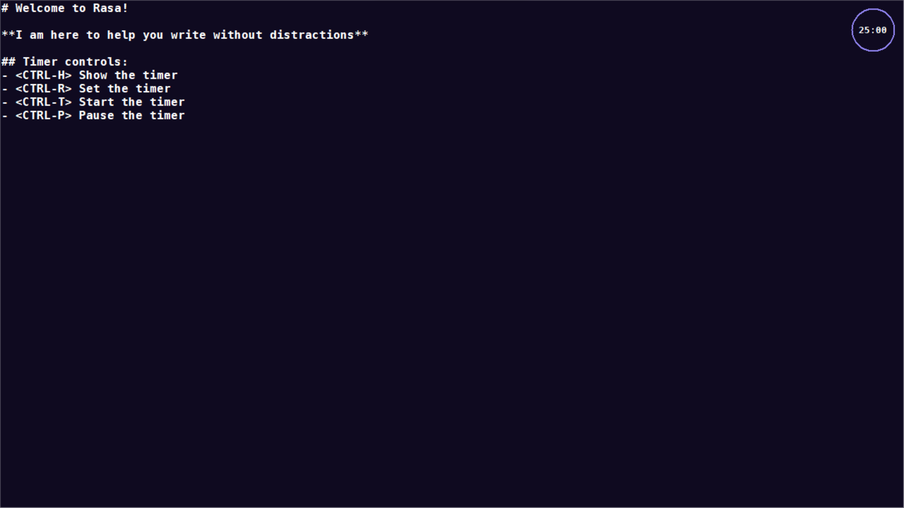
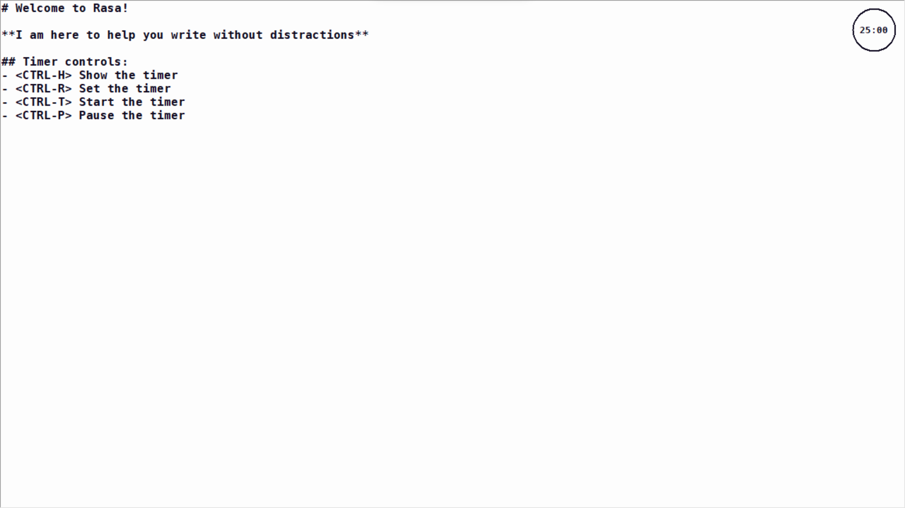
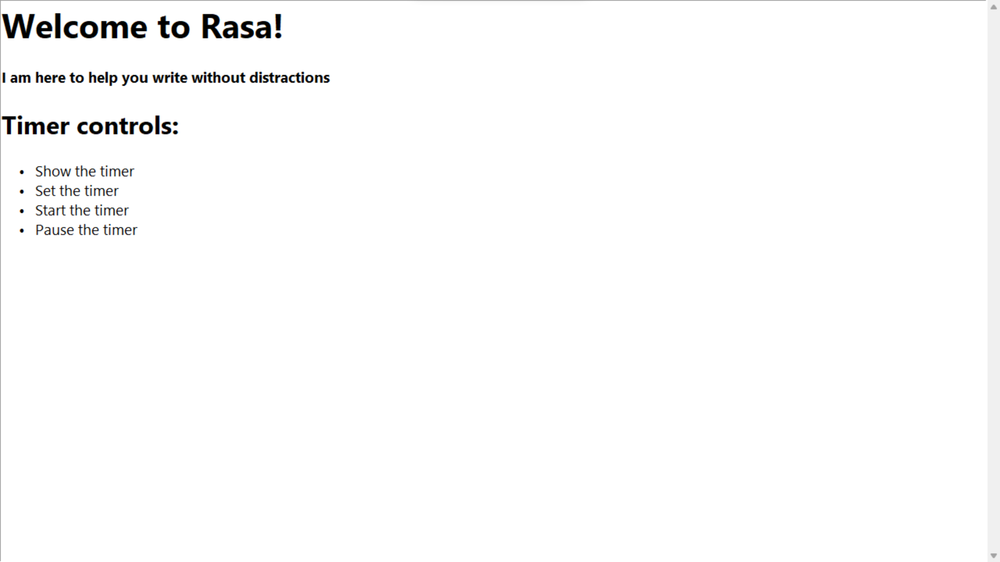

# Rasa

## Description
**A minimalist distraction-free text and markdown editor.**

## Features
- **Distraction-free:** No toolbars, no panes, no sidebars, no formatting, no nothing. Just you and your text.
- **Markdown support:** Rasa supports markdown syntax for rendering text.
- **Pomo timer:** Rasa has a built-in pomodoro timer to help you stay focused.
- **Dark mode:** Rasa has a dark mode for those who prefer it.
- **Cross-platform:** Rasa is available for Windows, macOS and Linux.

## Screenshots




## Installation

```bash
python -m pip install -r requirements.txt
```

## Usage

```bash
python rasa.py
```

## License
[MIT](https://choosealicense.com/licenses/mit/)

## Author
[Marc Bohler](https://marcbohler.com)